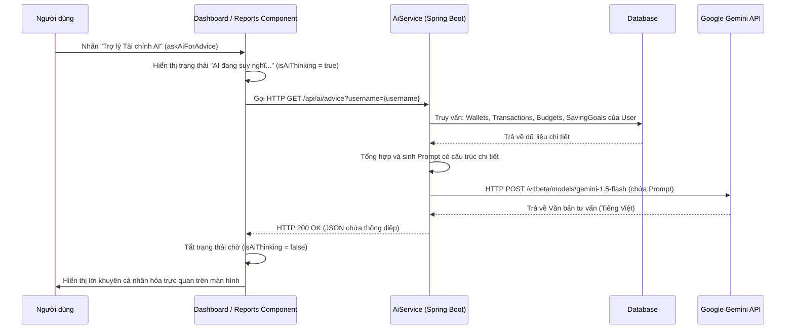

# HƯỚNG DẪN CẤU TRÚC VÀ LUỒNG HOẠT ĐỘNG CỦA MODULE AI SERVICE (TRỢ LÝ TÀI CHÍNH AI)

Tài liệu này mô tả chi tiết kiến trúc hệ thống, cấu trúc dữ liệu, các tệp nguồn và luồng nghiệp vụ chi tiết của tính năng **Trợ lý Tài chính AI (AiService)** trong ứng dụng WealthWise (Expense Tracker).

---

## 1. TỔNG QUAN VỀ MODULE AI SERVICE
Module **AiService** tích hợp mô hình ngôn ngữ lớn (Google Gemini API) nhằm cung cấp hai tính năng thông minh giúp nâng cao trải nghiệm quản lý tài chính cá nhân:
1.  **Tư vấn Tài chính cá nhân hóa (Financial Advice):** Phân tích dữ liệu thực tế của người dùng (tổng số dư các ví, cơ cấu chi tiêu theo danh mục tháng hiện tại, hạn mức chi tiêu, tiến độ mục tiêu tiết kiệm, và lịch sử giao dịch gần đây) để đưa ra nhận xét tổng quan cùng 3 lời khuyên thiết thực nhằm tối ưu ngân sách.
2.  **Ghi chép giao dịch bằng câu chat (Conversational Transaction Recording):** Cho phép người dùng nhập các câu tự nhiên (Ví dụ: *"ăn sáng 35k"*, *"nhận lương 10 triệu bằng ví chính"*). AI sẽ tự động phân tách ý định (CHAT hoặc TRANSACTION), trích xuất thông tin chi tiết (số tiền, nội dung, loại giao dịch, ví nguồn/đích, ngày giao dịch), tự động tạo giao dịch trong database, cập nhật số dư ví tương ứng và phản hồi trạng thái cho người dùng.

---

## 2. CẤU TRÚC DỮ LIỆU & CẤU HÌNH (CONFIGURATION & DTO)

### 2.1. Cấu hình API trong `application.properties`
Để kết nối với mô hình Gemini API của Google, backend sử dụng hai thuộc tính cấu hình:
*   `gemini.api.key`: API Key được cấp từ Google AI Studio.
*   `gemini.api.url`: Địa chỉ API Endpoint của Gemini (Ví dụ: `https://generativelanguage.googleapis.com/v1beta/models/gemini-1.5-flash:generateContent`).

### 2.2. DTO nhận diện đầu vào từ client
Để tiếp nhận câu chat từ giao diện người dùng, backend sử dụng DTO:
*   **ChatRequest** ([ChatRequest.java](file:///d:/expense-tracker-app/backend_qlct/src/main/java/fa/training/backend_qlct/dto/request/ChatRequest.java)): Chứa thông tin gửi lên bao gồm nội dung tin nhắn (`message`), ID người dùng (`userId`), và ID ví đang được chọn (`walletId` - tùy chọn).

### 2.3. Cấu trúc phản hồi JSON mong đợi từ Gemini API
Khi xử lý tin nhắn chat giao dịch, Prompt được thiết kế để ép mô hình Gemini luôn trả về định dạng JSON cấu trúc cụ thể:
```json
{
  "type": "CHAT" hoặc "TRANSACTION",
  "reply": "Lời phản hồi/tư vấn từ AI nếu là CHAT",
  "transactions": [
    {
      "note": "Nội dung giao dịch (Ăn phở, Mua cafe...)",
      "amount": 35000,
      "type": "EXPENSE" hoặc "INCOME",
      "category_name": "Tên danh mục gợi ý",
      "wallet_name": "Tên ví sử dụng hoặc null",
      "date": "YYYY-MM-DD hoặc null"
    }
  ]
}
```

---

## 3. KIẾN TRÚC BACKEND (SPRING BOOT)

### 3.1. Service Layer
Chịu trách nhiệm tương tác trực tiếp với cơ sở dữ liệu và gọi API ngoại vi Gemini:
*   **AiService** ([AiService.java](file:///d:/expense-tracker-app/backend_qlct/src/main/java/fa/training/backend_qlct/service/AiService.java)):
    *   `getFinancialAdvice(String username)`: Truy vấn toàn bộ dữ liệu tài chính của người dùng (ví, danh mục, giao dịch trong tháng, hạn mức ngân sách, mục tiêu tiết kiệm, giao dịch gần nhất), định dạng thành một Prompt có cấu trúc chi tiết, gọi API Gemini bằng `RestTemplate` và trả về văn bản lời khuyên dưới dạng thô để tối ưu hiển thị.
*   **TransactionService** ([TransactionService.java](file:///d:/expense-tracker-app/backend_qlct/src/main/java/fa/training/backend_qlct/service/TransactionService.java)):
    *   `processChat(String userInput, Long userId, Long walletId, String username)`: Thực hiện phân tích ngữ cảnh người dùng, tạo prompt yêu cầu phân loại và trích xuất thực thể. Sau khi nhận kết quả từ Gemini, phân tích mảng `transactions` để:
        1.  **Giải quyết ví tự động (Smart Wallet Resolution):** So khớp tên ví AI nhận diện với danh sách ví thực tế của người dùng, hoặc tự động chọn ví có số dư đủ/lớn nhất.
        2.  **Giải quyết danh mục tự động (Smart Category Resolution):** Tìm kiếm danh mục tương đồng nhất trong database, hoặc gán vào danh mục mặc định.
        3.  **Tạo giao dịch:** Gọi `createTransaction` để lưu giao dịch xuống DB và cập nhật số dư của ví đó.
    *   `callGeminiApi(String prompt)`: Xử lý đóng gói payload, thiết lập headers, và thực hiện gửi yêu cầu POST đến Google Gemini API.

### 3.2. Controller Layer (API Endpoints)
*   **AiController** ([AiController.java](file:///d:/expense-tracker-app/backend_qlct/src/main/java/fa/training/backend_qlct/controller/AiController.java)):
    *   `GET /api/ai/advice?username={username}`: Nhận tên tài khoản người dùng, trả về tư vấn tài chính dạng JSON `{ "message": "nội dung lời khuyên..." }`.
*   **TransactionController** ([TransactionController.java](file:///d:/expense-tracker-app/backend_qlct/src/main/java/fa/training/backend_qlct/controller/TransactionController.java)):
    *   `POST /api/transactions/chat`: Nhận body là `ChatRequest` chứa tin nhắn từ người dùng, thực hiện đăng ký giao dịch thông minh và trả về kết quả dưới dạng tin nhắn phản hồi.

---

## 4. KIẾN TRÚC FRONTEND (ANGULAR)

### 4.1. Components & Pages
*   **AiChatWidget** ([ai-chat-widget.ts](file:///d:/expense-tracker-app/frontend_qlct/src/app/layout/ai-chat-widget/ai-chat-widget.ts) | [ai-chat-widget.html](file:///d:/expense-tracker-app/frontend_qlct/src/app/layout/ai-chat-widget/ai-chat-widget.html)):
    *   Khai báo giao diện hộp thoại Chat ở góc dưới bên phải màn hình.
    *   Cho phép người dùng gõ tin nhắn hoặc click chọn các gợi ý mẫu có sẵn.
    *   Gửi yêu cầu POST chứa nội dung tin nhắn và `userId` tới `/api/transactions/chat`.
    *   Khi ghi nhận giao dịch thành công từ AI, component sẽ gọi `transactionService.notifyTransactionChange()` để cập nhật lại số dư ví và biểu đồ mà không cần tải lại trang.
*   **Dashboard & Reports Page** ([dashboard.ts](file:///d:/expense-tracker-app/frontend_qlct/src/app/pages/dashboard/dashboard.ts) | [reports.ts](file:///d:/expense-tracker-app/frontend_qlct/src/app/pages/reports/reports.ts)):
    *   Tích hợp nút "Trợ lý tài chính AI" hoặc tự động gọi API `/api/ai/advice?username={username}` để lấy lời khuyên tài chính cá nhân hóa khi người dùng click yêu cầu.

### 4.2. Kỹ thuật Angular Core áp dụng
1.  **Standalone & FormsModule:** Độc lập quản lý và liên kết dữ liệu tin nhắn qua `[(ngModel)]="chatMessage"`.
2.  **RxJS & Subject Notification:** Sử dụng `transactionChanges$` (một Subject của RxJS) trong `TransactionService` để phát tín hiệu cập nhật trạng thái dữ liệu giao dịch toàn cục cho các component khác sau khi AI ghi nhận giao dịch thành công.
3.  **DOM Manipulation (Cuộn tự động):** Đoạn mã `scrollToBottom()` sử dụng `ElementRef` để tự động kéo thanh cuộn xuống cuối cùng mỗi khi có tin nhắn mới gửi hoặc nhận, tạo cảm giác mượt mà khi tương tác.

---

## 5. LUỒNG HOẠT ĐỘNG CHI TIẾT (OPERATIONAL FLOWS)

### 5.1. Luồng Lấy Lời Khuyên Tài Chính (Get Financial Advice Flow)
Thực hiện khi người dùng yêu cầu tư vấn tại Dashboard hoặc trang Báo cáo.

#### Các bước thực hiện chi tiết:
1. **Bước 1 (Client - UI):** Người dùng nhấp vào nút "Trợ lý Tài chính AI" trên giao diện. Component lập tức kích hoạt trạng thái tải dữ liệu (`isAiThinking = true`) để hiển thị hiệu ứng chờ trên nút bấm.
2. **Bước 2 (Client -> Server):** Component gửi một yêu cầu HTTP GET Request tới endpoint `/api/ai/advice?username={username}` của backend.
3. **Bước 3 (Server):** `AiService` nhận yêu cầu, bắt đầu thực hiện truy vấn các thông tin tài chính thực tế của người dùng từ cơ sở dữ liệu (DB) thông qua các Repository:
   * Lấy danh sách tất cả các ví đang hoạt động và số dư hiện tại của chúng.
   * Lấy danh sách danh mục thu chi (của cá nhân người dùng và mặc định của hệ thống).
   * Lấy các giao dịch phát sinh trong tháng hiện tại để tính toán tổng thu nhập, chi tiêu thực tế, và thâm hụt/thặng dư hiện tại.
   * Lấy các hạn mức ngân sách tháng hiện tại (Budgets) để đối chiếu mức độ chi tiêu (bao gồm kiểm tra xem danh mục nào đã chi vượt ngân sách).
   * Lấy danh sách các mục tiêu tiết kiệm (Saving Goals) hiện có kèm theo tiến độ tích lũy thực tế.
   * Lấy lịch sử 10 giao dịch gần đây nhất để làm cơ sở phân tích thói quen tiêu dùng.
4. **Bước 4 (Server):** `AiService` tổng hợp tất cả dữ liệu thu thập được để xây dựng một prompt có cấu trúc chi tiết, yêu cầu mô hình AI phân tích tình hình tài chính của người dùng và đưa ra 3 lời khuyên thiết thực.
5. **Bước 5 (Server -> External API):** Backend thực hiện một HTTP POST request gửi prompt đã thiết lập đến dịch vụ Google Gemini API.
6. **Bước 6 (External API -> Server):** Gemini API tiếp nhận dữ liệu, phân tích hành vi chi tiêu và phản hồi văn bản tư vấn bằng tiếng Việt (nhận xét tổng quan tình hình tài chính tháng này và 3 lời khuyên tài chính cụ thể).
7. **Bước 7 (Server -> Client):** Backend nhận phản hồi từ Gemini API, bọc dữ liệu dưới dạng JSON và trả về cho Client với mã trạng thái `200 OK`.
8. **Bước 8 (Client - UI):** Component nhận dữ liệu phản hồi, tắt hiệu ứng chờ (`isAiThinking = false`), lưu văn bản vào biến `aiAdvice` và cập nhật trực quan lên giao diện người dùng.



### 5.2. Luồng Ghi Chép Giao Dịch Bằng Chat Widget (Transaction Recording Flow)
Thực hiện khi người dùng gửi một tin nhắn vào khung chat thông minh:

10:     Widget->>TxService: HTTP POST /api/transactions/chat (ChatRequest payload)
11:     TxService->>TxService: Thu thập ví, danh mục để tạo ngữ cảnh hệ thống
12:     TxService->>Gemini: Gửi Prompt yêu cầu trích xuất thông tin dạng JSON
13:     Gemini-->>TxService: Trả về JSON chứa thông tin trích xuất
14:     alt Type là CHAT (Trò chuyện/Hỏi đáp)
15:         TxService-->>Widget: Trả về nội dung trả lời (reply)
16:         Widget->>User: Hiển thị phản hồi từ AI
17:     else Type là TRANSACTION (Yêu cầu ghi chép)
18:         TxService->>TxService: Giải quyết ví (Wallet) & danh mục (Category) tối ưu nhất
19:         TxService->>DB: Insert giao dịch mới & cập nhật số dư ví
20:         DB-->>TxService: Thành công
21:         TxService-->>Widget: Trả về thông điệp xác nhận đã lưu giao dịch thành công
22:         Widget->>Widget: Phát tín hiệu thay đổi dữ liệu (notifyTransactionChange)
23:         Widget->>User: Hiển thị tin nhắn AI xác nhận lưu kèm số dư ví mới
24:     end
```

---

## 6. MỐI LIÊN KẾT GIỮA AI SERVICE VỚI CÁC MODULE KHÁC

1.  **Giao dịch & Ví (Transactions & Wallets):**
    *   AI Service trực tiếp phân tích thói quen tiêu dùng thông qua lịch sử giao dịch và số dư ví.
    *   Tự động phát sinh giao dịch mới vào các ví thực tế trong database của người dùng khi nhận diện được ý định ghi chép giao dịch.
2.  **Danh mục & Hạn mức (Categories & Budgets):**
    *   Khi tư vấn, AI sẽ rà soát các danh mục xem người dùng có bị vượt hạn mức chi tiêu nào trong tháng không để đưa ra cảnh báo kịp thời.
    *   Tự động phân loại danh mục thông minh (ví dụ: gõ *"ăn uống"* hay *"mua sắm"* sẽ tự động khớp vào các danh mục tương ứng có sẵn của người dùng).
3.  **Mục tiêu Tiết kiệm (Saving Goals):**
    *   AI thu thập tiến độ của các mục tiêu tích lũy nhằm đưa ra lời khuyên động viên, định hướng phân bổ tài sản thông minh giúp người dùng đạt mục tiêu đúng hạn.
