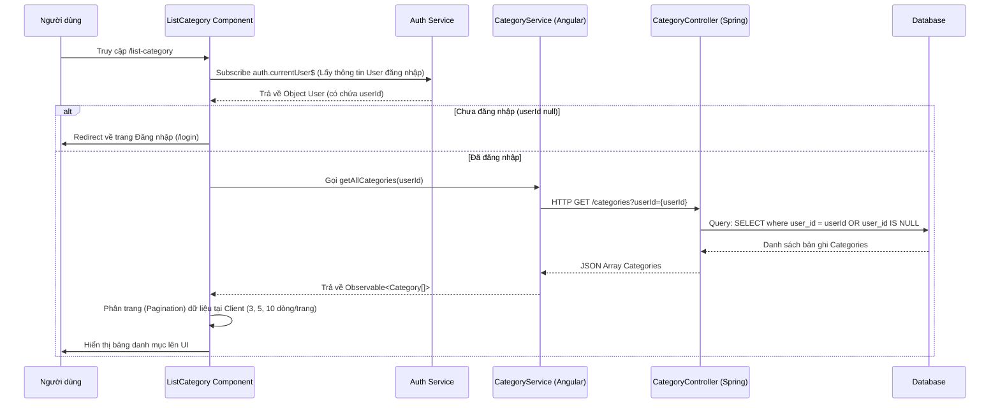
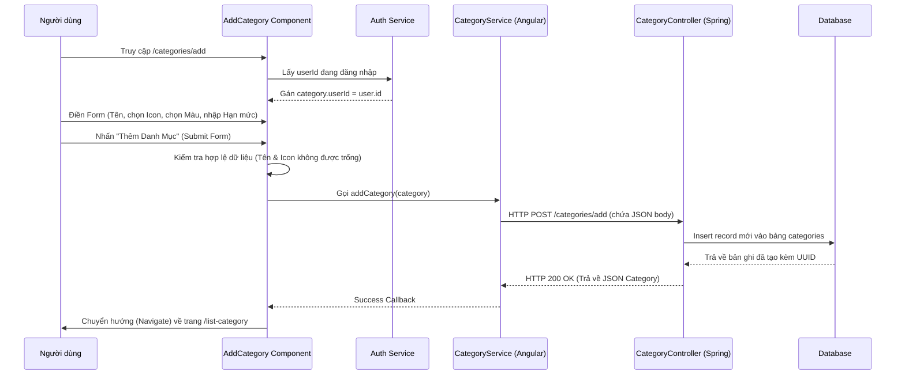
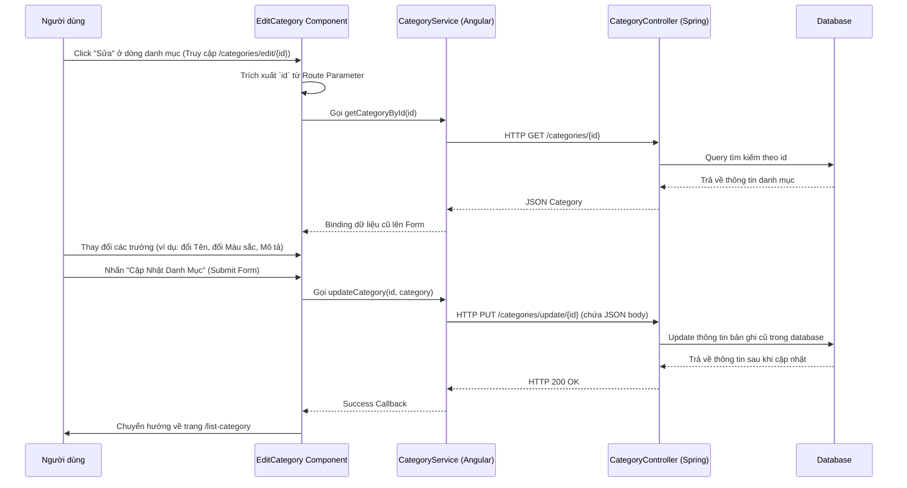
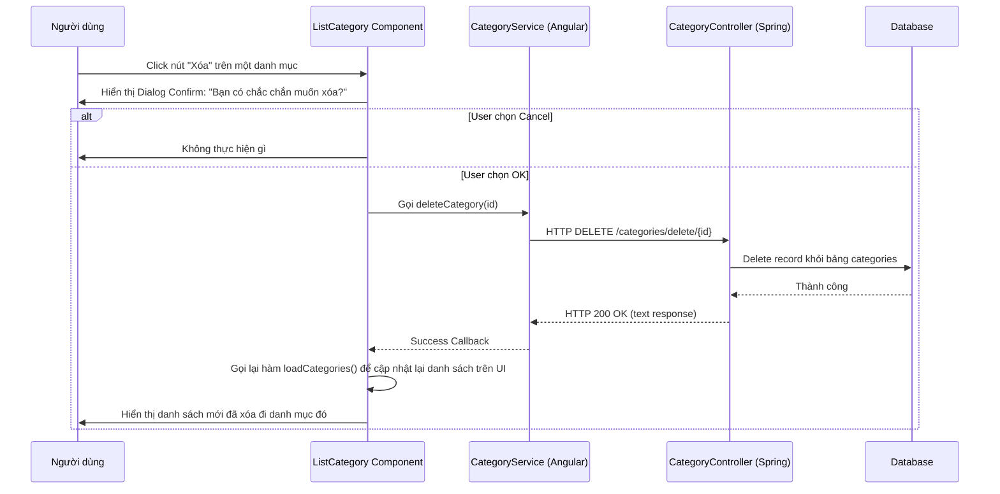

# HƯỚNG DẪN CẤU TRÚC VÀ LUỒNG HOẠT ĐỘNG CỦA MODULE CATEGORY (DANH MỤC THU CHI)

Tài liệu này mô tả chi tiết kiến trúc hệ thống, cấu trúc dữ liệu, cấu trúc thư mục code và luồng nghiệp vụ chi tiết của tính năng **Quản lý Danh mục (Category)** trong ứng dụng WealthWise (Expense Tracker).

---

## 1. TỔNG QUAN VỀ MODULE CATEGORY
Module **Category** giúp người dùng phân loại các khoản chi tiêu hoặc thu nhập (Ví dụ: *Ăn uống, Lương, Mua sắm, Điện nước...*).
*   **Loại danh mục:** `EXPENSE` (Khoản chi) hoặc `INCOME` (Khoản thu).
*   **Phạm vi sở hữu:**
    1.  **Danh mục hệ thống (System Default):** `userId = null`. Bất kỳ người dùng nào cũng có thể xem và chọn các danh mục này để tạo giao dịch, nhưng không được phép chỉnh sửa hoặc xóa chúng.
    2.  **Danh mục cá nhân (User Custom):** `userId` chứa ID của người dùng. Danh mục này do chính người dùng tự tạo ra, chỉ xuất hiện trên tài khoản của họ và họ có toàn quyền CRUD (Thêm, Sửa, Xóa).
*   **Thuộc tính bổ sung:** Icon (biểu tượng đại diện), Màu sắc (Color hex code), Mô tả (Description), và Ngân sách tháng (Monthly Budget - giới hạn chi tiêu tối đa mỗi tháng cho danh mục đó).

---

## 2. CẤU TRÚC CƠ SỞ DỮ LIỆU (DATABASE SCHEMA)

Bảng dữ liệu trong cơ sở dữ liệu có tên là `categories` (hoặc map qua class `Categories.java` trong JPA).

### Chi tiết các trường trong bảng `categories`:
| Tên cột | Kiểu dữ liệu | Ràng buộc | Mô tả |
| :--- | :--- | :--- | :--- |
| `id` | `VARCHAR(36)` | `PRIMARY KEY` (UUID) | Mã định danh duy nhất của danh mục. |
| `name` | `VARCHAR(255)` | `NOT NULL` | Tên của danh mục (Ví dụ: Ăn uống, Lương tháng 5). |
| `icon` | `VARCHAR(255)` | `NOT NULL` | Tên icon từ thư viện Google Material Symbols (Ví dụ: `restaurant`, `payments`). |
| `type` | `VARCHAR(50)` | `NOT NULL` | Phân loại danh mục: `EXPENSE` (Khoản chi) hoặc `INCOME` (Khoản thu). |
| `user_id` | `BIGINT` | `FOREIGN KEY` (Nullable) | Tham chiếu đến bảng `users(id)`. Nếu `NULL`, đây là danh mục hệ thống mặc định. |
| `color` | `VARCHAR(50)` | Nullable | Mã màu hiển thị dạng Hex (Ví dụ: `#FF5733`). |
| `description` | `VARCHAR(500)` | Nullable | Mô tả ngắn gọn về danh mục. |
| `monthly_budget`| `DOUBLE` | Nullable | Hạn mức ngân sách tối đa hàng tháng. Nếu `NULL`, danh mục này không giới hạn chi tiêu. |

---

## 3. KIẾN TRÚC BACKEND (SPRING BOOT)

### 3.1. Entity Layer
*   **File nguồn:** [Categories.java](file:///d:/expense-tracker-app/backend_qlct/src/main/java/fa/training/backend_qlct/entities/Categories.java)
*   **Chi tiết:** Định nghĩa Entity ánh xạ trực tiếp sang bảng `categories` trong MySQL. Sử dụng JPA `@GeneratedValue(strategy = GenerationType.UUID)` để tạo khóa chính ngẫu nhiên dạng chuỗi UUID.

### 3.2. Data Transfer Objects (DTO)
Để giao tiếp an toàn giữa client và server mà không để lộ thực thể database trực tiếp, backend sử dụng 2 DTO:
1.  **CategoryCreationRequest** ([CategoryCreationRequest.java](file:///d:/expense-tracker-app/backend_qlct/src/main/java/fa/training/backend_qlct/dto/request/CategoryCreationRequest.java)): Chứa thông tin gửi lên khi tạo mới danh mục.
2.  **CategoryUpdateRequest** ([CategoryUpdateRequest.java](file:///d:/expense-tracker-app/backend_qlct/src/main/java/fa/training/backend_qlct/dto/request/CategoryUpdateRequest.java)): Chứa các thông tin để cập nhật danh mục hiện tại.

### 3.3. Repository Layer
*   **File nguồn:** [CategoryRepository.java](file:///d:/expense-tracker-app/backend_qlct/src/main/java/fa/training/backend_qlct/respository/CategoryRepository.java)
*   **Chi tiết:** Interface kế thừa `JpaRepository<Categories, String>`. Chứa các câu truy vấn HQL/JPQL tùy chỉnh:
    *   `findByUserIdOrUserIdIsNull(Long userId)`: Lấy ra danh sách tất cả các danh mục thuộc về `userId` được truyền vào cộng với các danh mục mặc định của hệ thống (`userId IS NULL`).
    *   `findByUserIdAndNameContaining(Long userId, String query)`: Hỗ trợ tìm kiếm danh mục theo từ khóa tên của người dùng hoặc hệ thống.

### 3.4. Service Layer
*   **File nguồn:** [CategoryService.java](file:///d:/expense-tracker-app/backend_qlct/src/main/java/fa/training/backend_qlct/service/CategoryService.java)
*   **Các phương thức cốt lõi:**
    *   `categoryRequest(CategoryCreationRequest request)`: Nhận DTO khởi tạo, ánh xạ sang Entity `Categories`, gọi `categoryRepository.save()` để lưu xuống DB.
    *   `getCategoriesByUser(Long userId)`: Gọi Repository để lấy toàn bộ danh mục của người dùng hiện tại + danh mục hệ thống.
    *   `getCategory(String id)`: Lấy thông tin chi tiết một danh mục theo `id`. Ném ra ngoại lệ `RuntimeException` nếu không tồn tại.
    *   `updateCategoryRequest(String id, CategoryUpdateRequest request)`: Tìm kiếm danh mục theo `id`, gán lại các giá trị mới từ DTO cập nhật, gọi `categoryRepository.save()`.
    *   `deleteCategory(String id)`: Xóa danh mục khỏi cơ sở dữ liệu dựa trên ID.

### 3.5. Controller Layer (API Endpoints)
*   **File nguồn:** [CategoryController.java](file:///d:/expense-tracker-app/backend_qlct/src/main/java/fa/training/backend_qlct/controller/CategoryController.java)
*   **Base URL:** `/categories`
*   **Danh sách API:**
    *   `POST /categories/add`: Tạo danh mục mới. Nhận body là `CategoryCreationRequest`.
    *   `GET /categories?userId={userId}`: Lấy danh sách danh mục. Nếu có tham số `userId`, API trả về danh mục cá nhân của người đó + danh mục hệ thống mặc định. Nếu không truyền `userId`, chỉ trả về danh mục hệ thống mặc định (`userId IS NULL`).
    *   `GET /categories/{id}`: Xem chi tiết danh mục theo `id`.
    *   `PUT /categories/update/{id}`: Cập nhật danh mục theo `id`. Nhận body là `CategoryUpdateRequest`.
    *   `DELETE /categories/delete/{id}`: Xóa danh mục theo `id`.

---

## 4. KIẾN TRÚC FRONTEND (ANGULAR)

### 4.1. Model Layer
*   **File nguồn:** [category.ts](file:///d:/expense-tracker-app/frontend_qlct/src/app/model/category.ts)
*   **Mô tả:** Định nghĩa class client-side `Category` tương thích hoàn toàn với cấu trúc JSON trả về từ backend.

### 4.2. Service Layer
*   **File nguồn:** [category-service.ts](file:///d:/expense-tracker-app/frontend_qlct/src/app/services/category-service.ts)
*   **Nhiệm vụ:** Sử dụng Angular `HttpClient` để thực hiện các yêu cầu HTTP (GET, POST, PUT, DELETE) đến API Gateway ở cổng `http://localhost:8080/categories`.

### 4.3. Cấu trúc Routing & Trang hiển thị
Khai báo định tuyến trong [app.routes.ts](file:///d:/expense-tracker-app/frontend_qlct/src/app/app.routes.ts):
*   `/list-category` hoặc `/categories`: Hiển thị danh sách danh mục (Component `ListCategory`).
*   `/categories/add`: Mở trang thêm mới danh mục (Component `AddCategory`).
*   `/categories/edit/:id`: Mở trang chỉnh sửa danh mục (Component `EditCategory`).

### 4.4. Các Kiến Thức và Kỹ Thuật Angular Core Được Vận Dụng

Trong Module Category, các kiến thức cốt lõi sau của Angular được áp dụng trực tiếp:

1. **Standalone Components (Component độc lập):**
   * Dự án sử dụng Angular phiên bản mới (Angular 17+), nơi các Component được khai báo với thuộc tính `imports` ngay trong `@Component` metadata (ví dụ: `imports: [FormsModule, RouterLink, CommonModule]`), giúp quản lý trực tiếp các module phụ thuộc mà không cần tệp `NgModule` truyền thống.

2. **Template-Driven Forms & Validation (Form dựa trên Template):**
   * **Liên kết dữ liệu hai chiều (Two-way Data Binding):** Sử dụng cú pháp ngModel: `[(ngModel)]="category.name"` và `[(ngModel)]="category.icon"` để đồng bộ hóa ngay lập tức dữ liệu giữa Form trên giao diện HTML và đối tượng trong file TypeScript.
   * **Xử lý Validation phía Client:** Sử dụng thẻ `required` kết hợp với biến tham chiếu cục bộ `#categorynameInput="ngModel"`. Qua đó, giao diện hiển thị thông báo lỗi trực quan bằng cách kiểm tra các trạng thái:
     * `invalid`: Trường nhập liệu không hợp lệ.
     * `dirty`: Dữ liệu trong trường nhập liệu đã bị thay đổi bởi người dùng.
     * `touched`: Người dùng đã click vào và rê chuột ra khỏi trường nhập liệu.

3. **RxJS & Reactive Programming (Lập trình phản ứng):**
   * Sử dụng đối tượng **Observable** từ `HttpClient` để thực hiện các cuộc gọi API bất đồng bộ lên Backend.
   * Sử dụng phương thức `.subscribe()` để lắng nghe kết quả trả về từ luồng dữ liệu (Data Stream).
   * Điển hình là việc lắng nghe thông tin tài khoản đăng nhập qua `auth.currentUser$.subscribe()` để tự động lấy `userId` gán vào danh mục được tạo hoặc chỉnh sửa.

4. **Dependency Injection (Tiêm phụ thuộc):**
   * Tiêm (Inject) các Service, Router, ActivatedRoute, và ChangeDetectorRef qua phương thức `constructor` của component (ví dụ: `constructor(private categoryService: CategoryService, private router: Router, private route: ActivatedRoute, private cdr: ChangeDetectorRef, private auth: Auth)`). Cú pháp này giúp Angular tự động khởi tạo và quản lý vòng đời của các Service.

5. **Angular Router & Dynamic Routing (Định tuyến động):**
   * **Điều hướng khai báo (Declarative Navigation):** Sử dụng thuộc tính `routerLink="/categories/add"` trong HTML để điều hướng trang mà không làm tải lại toàn bộ trang (Single Page Application - SPA).
   * **Điều hướng lập trình (Programmatic Navigation):** Sử dụng `this.router.navigate(['/list-category'])` trong file TypeScript để chuyển trang tự động sau khi CRUD thành công.
   * **Tham số đường dẫn (Route Parameters):** Trong trang Sửa, sử dụng `this.route.snapshot.paramMap.get('id')` để trích xuất ID danh mục từ URL `/categories/edit/:id`.

6. **Modern Control Flow (Cú pháp điều khiển mới của Angular 17+):**
   * **Cú pháp lặp `@for`:** Sử dụng cấu trúc `@for (category of paginatedCategories; track category.id)` tối ưu hóa hiệu năng render DOM nhờ cơ chế tracking theo ID thay vì sử dụng directive `*ngFor` cũ.
   * **Cú pháp rỗng `@empty`:** Tiện lợi để hiển thị thông báo mặc định khi danh sách danh mục trống mà không cần thêm logic kiểm tra `length`.
   * **Cú pháp điều kiện `@if ... @else`:** Sử dụng `@if (isLoading)` để kiểm soát trạng thái hiển thị màn hình chờ (loading screen) thay thế cho `*ngIf`.

7. **Change Detection Control (Cơ chế phát hiện thay đổi):**
   * Sử dụng dịch vụ `ChangeDetectorRef` và gọi phương thức `this.cdr.detectChanges()` để chủ động thông báo cho Angular render lại giao diện ngay khi nhận được phản hồi bất đồng bộ từ API, tránh tình trạng UI bị trễ hoặc không cập nhật kịp thời.

8. **Client-side Pagination (Logic phân trang tại client):**
   * Áp dụng thuật toán chia mảng `categories` gốc thành mảng con `paginatedCategories` bằng hàm `.slice(startIndex, endIndex)` dựa trên thuộc tính `currentPage` và `pageSize`, giúp tối ưu lượng dữ liệu hiển thị trên một trang và trải nghiệm người dùng.

---

## 5. LUỒNG HOẠT ĐỘNG CHI TIẾT (OPERATIONAL FLOWS)

### 5.1. Luồng Lấy và Hiển thị danh sách Danh mục (Get List Flow)
Luồng này thực hiện khi người dùng truy cập trang Quản lý Danh mục:

### 5.2. Luồng Thêm mới Danh mục (Create Flow)
Luồng xử lý khi người dùng thêm một danh mục tùy chỉnh cá nhân:

### 5.3. Luồng Chỉnh sửa Danh mục (Update Flow)
Luồng xử lý khi người dùng chỉnh sửa thông tin một danh mục:

### 5.4. Luồng Xóa Danh mục (Delete Flow)
Luồng xử lý khi người dùng thực hiện xóa một danh mục:

---

## 6. MỐI LIÊN KẾT GIỮA CATEGORY VỚI CÁC MODULE KHÁC

1.  **Giao dịch (Transactions):**
    *   Mỗi giao dịch thuộc một danh mục cụ thể (`category_id` là khóa ngoại trỏ từ bảng `transactions` sang bảng `categories`).
    *   Khi người dùng tạo hoặc sửa giao dịch, họ sẽ lựa chọn danh mục trong danh sách dropdown được lấy từ API `GET /categories?userId={userId}`.
2.  **Ngân sách (Budgets):**
    *   Tính năng ngân sách được liên kết trực tiếp với từng danh mục.
    *   Người dùng có thể cài đặt ngân sách tối đa trong một tháng cho từng Danh mục (ví dụ: danh mục "Ăn uống" có ngân sách 3.000.000₫/tháng).
    *   Thông số `monthlyBudget` cũng được tích hợp thẳng vào thực thể `Categories` để tiện hiển thị/kiểm tra hạn mức.
3.  **Trợ lý ảo AI (AI Advisor) & Thống kê (Dashboard/Reports):**
    *   Các báo cáo cơ cấu chi tiêu hiển thị dưới dạng biểu đồ tròn (Pie Chart) sử dụng thông tin của `Categories` (Tên danh mục, màu sắc thiết lập sẵn `color`, loại `type` để tính tổng) giúp trực quan hóa tiền bạc của người dùng.
    *   Trợ lý AI sẽ quét dữ liệu chi tiêu phân loại theo từng danh mục này để phát hiện các xu hướng chi tiêu bất hợp lý và đưa ra lời khuyên tài chính cá nhân hóa.
